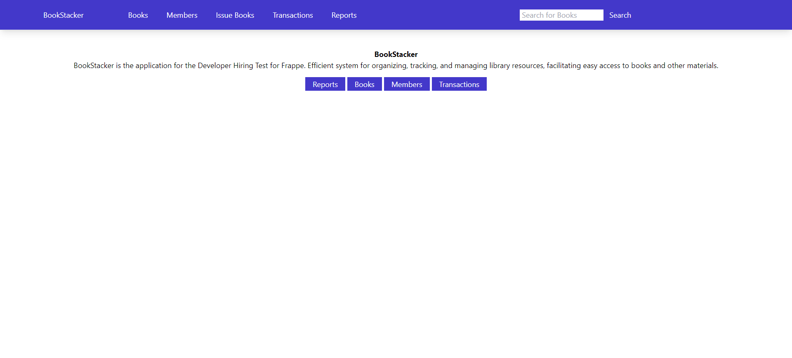
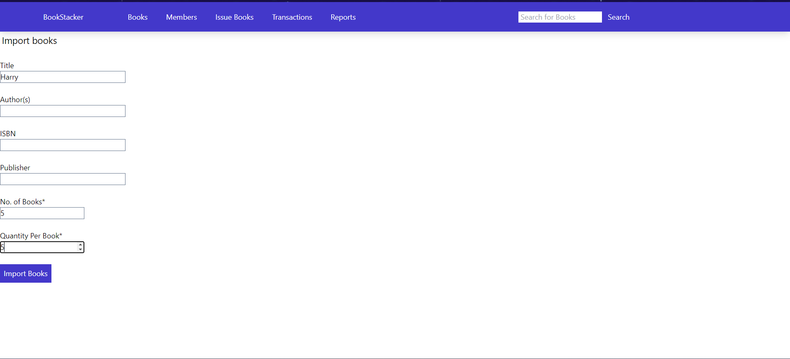
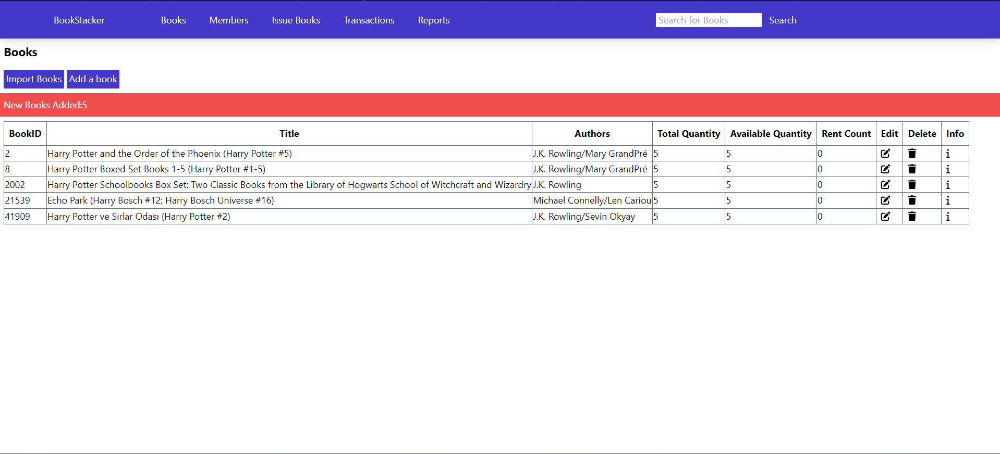
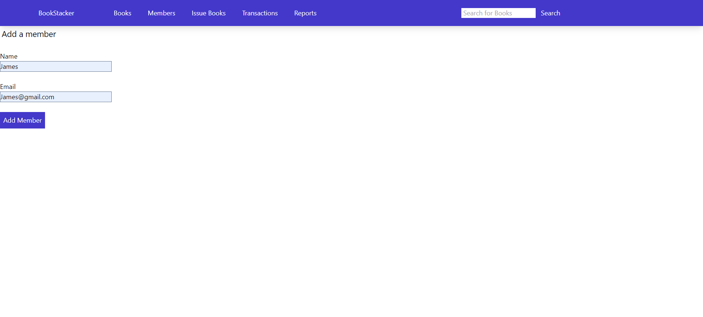
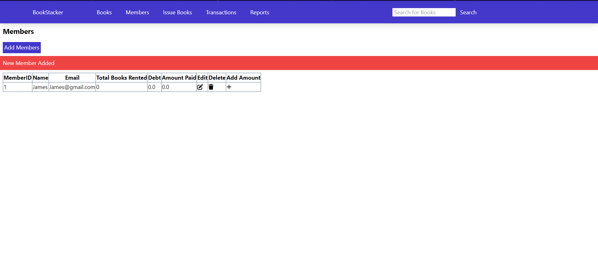
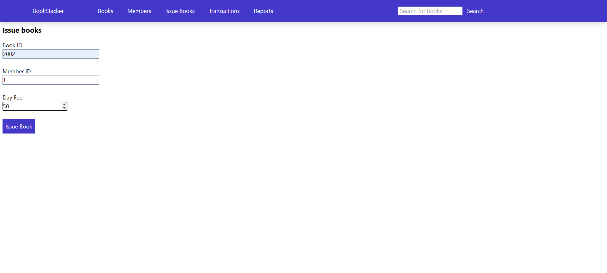
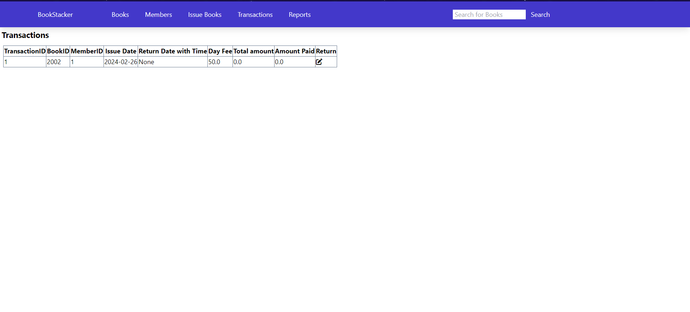
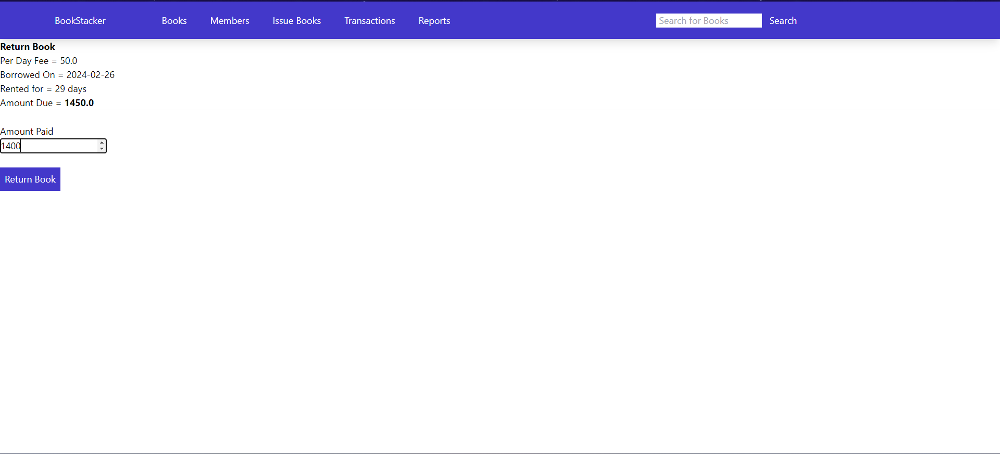
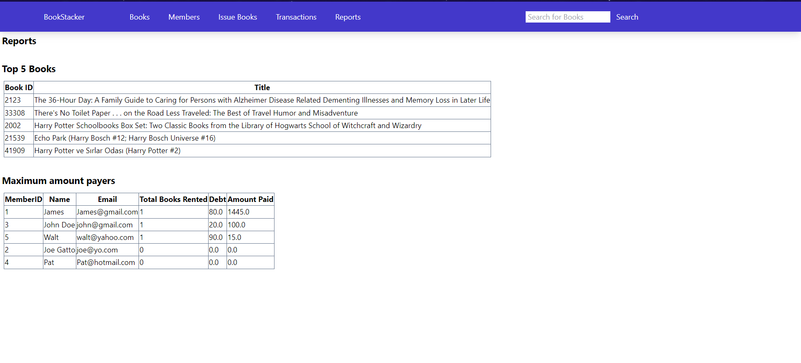

# BookStacker
BookStacker is the application for the library management system. It is a web-based application that helps to manage and organize library resources. It is designed to help librarians and library staff to keep track of books, journals, and other materials in the library. It provides an efficient system for organizing, tracking, and managing library resources, facilitating easy access to books and other materials.

## Features
- **Book Management**: Add, edit, and delete books from the library collection. Also includes features to search for books by title, author and importing books from Frappe API. 
- **Members Management**: Manage library members, including adding new members, editing user information, and deleting members.
- **Borrowing and Returning Books**: Keep track of books that are borrowed by members and return them when they are due. Also includes feature to disable members who have debt more than or equal to 500.
- **Reports**: Generate reports on books and members.

## Installation
1. Clone the repository
```bash
git clone https://github.com/Dhairya3124/libmanage
```
2. For this project you need to have Docker installed on your system. If you don't have Docker installed, you can download it from [here](https://docs.docker.com/get-docker/). After installing Docker, run the following command to start the application.
```bash
docker-compose build && docker-compose up
```
3. Open your browser and go to `http://localhost:4000` to access the application.

## Technologies Used
- **Frontend**: Jinja2, HTML, TailwindCSS
- **Backend**: Python, Flask
- **Database**: PostgreSQL(ORM: SQLAlchemy)
- **Containerization**: Docker

## Screenshots
### Home Page

### Import Books

### Books List

### Add a Member

### Members List

### Issue Book

### Transactions

### Return Book

### Transactions after returning book

### Reports
